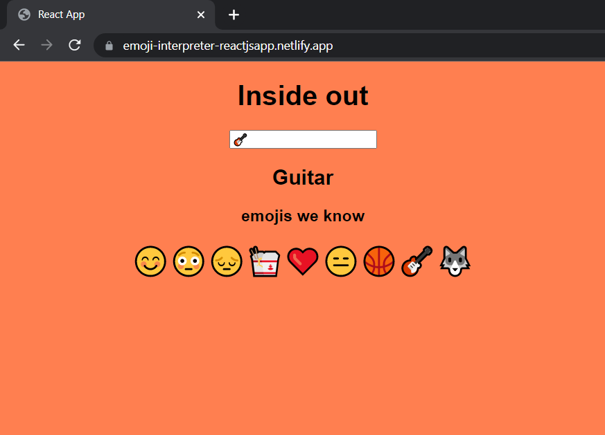

# Emoji Interpreter react.js app
This app is a shows the meaning of an entered emoji which is made as part of level zero of neog camp.
## Technologies
* HTML5
* CSS3
* ReactJS
## Preview Link
https://emoji-interpreter-reactjsapp.netlify.app/
## Home Page
